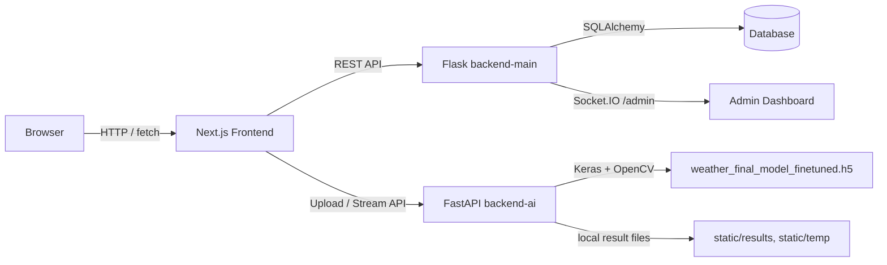
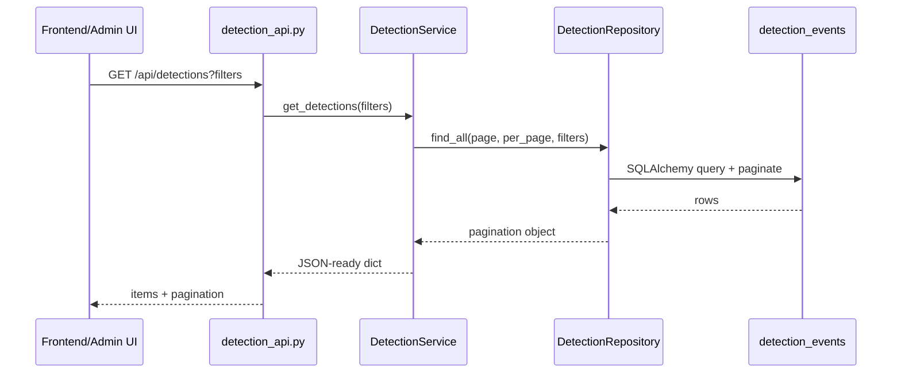
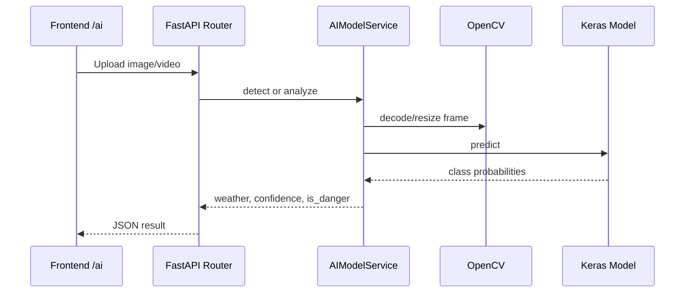

# Weather-AI Architecture

이 문서는 현재 저장소에 구현된 코드를 기준으로 작성한 아키텍처 문서입니다.

## 1. 전체 구조

Weather-AI는 크게 세 개의 런타임으로 나뉩니다.

```text
weather-ai
├── frontend       # Next.js App Router 기반 사용자/관리자 UI
├── backend-main   # Flask 기반 메인 API, DB, 인증, 관리자, 탐지 조회
└── backend-ai     # FastAPI 기반 AI 추론 서버
```



## 2. Frontend

위치: `frontend/`

기술 스택:

- Next.js 16 App Router
- React 19
- TypeScript
- CSS Modules

주요 페이지:

| 경로 | 파일 | 역할 |
| --- | --- | --- |
| `/` | `src/app/page.tsx` | 메인 화면 |
| `/intro` | `src/app/intro/page.tsx` | 서비스 소개 |
| `/login` | `src/app/login/page.tsx` | 일반 로그인 |
| `/register` | `src/app/register/page.tsx` | 회원가입 |
| `/find-id` | `src/app/find-id/page.tsx` | 아이디 찾기 |
| `/mypage` | `src/app/mypage/page.tsx` | 마이페이지 |
| `/admin` | `src/app/admin/page.tsx` | 관리자 화면 |
| `/board` | `src/app/board/page.tsx` | 게시판 화면 |
| `/ai` | `src/app/ai/page.tsx` | 이미지/영상/스트림 AI 분석 화면 |
| `/auth/callback` | `src/app/auth/callback/page.tsx` | 소셜 로그인 콜백 처리 |

주요 컴포넌트:

- `components/layout/Header.tsx`: 공통 헤더
- `components/auth/*LoginButton.tsx`: Google, Kakao, Naver 로그인 버튼
- `components/weather/WeatherOverlay.tsx`: 날씨 오버레이 UI

환경 변수:

- `NEXT_PUBLIC_API_BASE_URL`: Flask 메인 API 주소. 기본값은 `http://localhost:5000`
- `NEXT_PUBLIC_AI_URL`: FastAPI AI 서버 주소. 기본값은 `http://localhost:8000`

## 3. Main Backend

위치: `backend-main/`

기술 스택:

- Flask
- Flask-SQLAlchemy
- Flask-CORS
- Flask-SocketIO
- python-dotenv

앱 진입점:

- `run.py`: Flask 실행 진입점
- `app/__init__.py`: 앱 팩토리, DB/CORS/Socket.IO/Blueprint 등록

레이어 구조:

```text
backend-main/app
├── api             # Flask Blueprint. HTTP 요청/응답 처리
├── services        # 비즈니스 로직, 응답 가공
├── repositories    # SQLAlchemy DB 조회
├── models          # DB 모델
└── socket_events.py # 관리자 실시간 알림
```

### 3.1 Blueprint/API

| Prefix | 주요 파일 | 역할 |
| --- | --- | --- |
| `/api/member` | `member_api.py` | 회원가입, 로그인, 내 정보, 로그아웃, 아이디 찾기 |
| `/api/auth/kakao` | `auth/kakao_auth_api.py` | Kakao OAuth 로그인/콜백 |
| `/api/auth/naver` | `auth/naver_auth_api.py` | Naver OAuth 로그인/콜백 |
| `/api/auth/google` | `auth/google_auth_api.py` | Google OAuth 로그인/콜백 |
| `/api/cctv` | `cctv_api.py` | CCTV 목록/스트림 |
| `/api/detections` | `detection_api.py` | 탐지 이벤트 목록/상세 조회 |
| `/api/admin/alerts` | `alert_api.py` | 관리자 알림 목록/지도/위치/상세 |
| `/api/map` | `map_api.py` | 지도용 이벤트 조회 |
| `/api/dashboard` | `dashboard_api.py` | 대시보드 요약 |
| `/api/chatbot` | `chatbot_api.py` | 챗봇 메시지 처리 |
| `/api/admin` | `admin_api.py` | 관리자 사용자/통계/알림 더미성 API |
| `/api/admin/members` | `admin_member_api.py` | 관리자 회원 목록/상세 |

### 3.2 주요 데이터 모델

| 모델 | 테이블 | 역할 |
| --- | --- | --- |
| `Member` | `members` | 일반/소셜 회원 정보, 권한, 상태, 감사 시간 |
| `EventLog` | `event_logs` | 실시간 위험 알림 로그 |
| `DetectionEvent` | `detection_events` | CCTV/날씨/차량/위험도/LLM 판단 결과를 포함한 탐지 이벤트 |

`DetectionEvent`는 현재 시스템의 핵심 조회 데이터입니다. 주요 필드는 다음과 같습니다.

- 위치: `location_name`, `latitude`, `longitude`
- 날씨/시간: `weather_type`, `time_type`
- 차량: `normal_vehicle_count`, `risk_vehicle_count`, `total_vehicle_count`, `main_vehicle_type`
- 위험도: `risk_score`, `risk_level`, `event_status`, `alert_required`
- AI/LLM 판단: `model_name`, `detection_confidence`, `llm_decision`, `llm_reason`, `false_positive_suspected`
- 시간: `detected_at`, `created_at`, `updated_at`

### 3.3 탐지 조회 흐름



지원하는 주요 필터:

- `keyword`
- `start_date`, `end_date`
- `location_name`
- `weather_type`
- `risk_level`
- `main_vehicle_type`
- `event_status`
- `time_type`
- `alert_required`

### 3.4 챗봇 흐름

현재 챗봇은 LLM API가 아니라 키워드 기반 의도 분류로 동작합니다.

```text
POST /api/chatbot/message
  -> ChatbotService.create_response(message)
  -> intent 분류: risk_status / service_help / cctv_help / unknown
  -> risk_status면 DetectionRepository에서 알림 필요 이벤트 검색
  -> 답변 문장 + 관련 이벤트 반환
```

## 4. AI Backend

위치: `backend-ai/`

기술 스택:

- FastAPI
- Keras, torch backend
- OpenCV
- NumPy

앱 진입점:

- `app/main.py`: FastAPI 앱 생성, CORS 설정, AI router 등록
- `app/controller/ai_model_controller.py`: `/api/ai` 라우터
- `app/service/ai_model_service.py`: 모델 로딩, 이미지/영상/스트림 분석

모델:

- 파일명: `weather_final_model_finetuned.h5`
- 클래스: `fog`, `heavy_rain`, `heavy_snow`, `sun`
- 위험 클래스: `fog`, `heavy_rain`, `heavy_snow`

AI API:

| Method | Path | 역할 |
| --- | --- | --- |
| `GET` | `/` | AI 서버 헬스 체크 |
| `POST` | `/api/ai/detect` | 이미지 파일 분석, 저장 없이 결과 반환 |
| `POST` | `/api/ai/detect_and_save` | 이미지 분석 후 라벨이 그려진 결과 이미지 저장 |
| `POST` | `/api/ai/analyze_and_save_video` | 영상 파일을 일정 프레임 간격으로 분석 |
| `POST` | `/api/ai/cctv_stream` | RTSP/HTTP 스트림을 읽고 분석 라벨을 입힌 MJPEG 스트림 반환 |

AI 처리 흐름:



## 5. 인증/권한

현재 구현된 인증 기능:

- 일반 회원가입: `/api/member/register`
- 일반 로그인: `/api/member/login`
- 현재 사용자 조회: `/api/member/me`
- 로그아웃: `/api/member/logout`
- 아이디 찾기: `/api/member/find-id`
- 소셜 로그인: Kakao, Naver, Google

`Member.role`은 `admin`, `manager`, `user` 값을 가질 수 있습니다. 관리자용 API는 `/api/admin`, `/api/admin/members`, `/api/admin/alerts` 아래에 분리되어 있습니다. `admin`과 `manager`는 권한상 동일하게 취급되며(`app/utils/auth_decorators.py`의 `admin_required`), 관리자 API 전반에서 이 정책을 일관되게 따릅니다.

JWT 서명/검증은 `python-jose` 기반 커스텀 구현(`app/services/auth_utils.py`)이 전담하며, `SECRET_KEY` 환경변수가 없으면 앱이 기동 시점에 즉시 에러를 냅니다(하드코딩된 기본값 없음).

### 5.1 Main backend ↔ AI backend 내부 인증

backend-ai(FastAPI)의 `/api/ai/*` 엔드포인트는 브라우저가 직접 호출하지 않고 backend-main만 호출하는 구조입니다. 이를 강제하기 위해 두 서버가 `AI_INTERNAL_SECRET` 환경변수(동일한 값)를 공유하고, backend-main은 요청마다 `X-Internal-Secret` 헤더를 실어 보냅니다(`app/services/ai_client_auth.py`). backend-ai는 이 헤더를 검증하는 FastAPI dependency(`app/security.py`)를 모든 `/api/ai/*` 라우터에 적용합니다. 이 값이 없으면 backend-ai도 기동 시점에 에러를 냅니다.

## 6. 실시간 알림

`backend-main/app/socket_events.py`에서 관리자 네임스페이스 `/admin`을 사용합니다.

```text
send_danger_alert(event_data)
  -> EventLog 저장
  -> risk_level >= 7 인 경우 Socket.IO critical_alert emit
```

이 구조는 AI 분석 결과 또는 탐지 이벤트 생성 로직에서 `send_danger_alert`를 호출하면 관리자 대시보드로 실시간 알림을 보낼 수 있게 설계되어 있습니다.

## 7. 로컬 실행 포트

| 런타임 | 기본 포트 | 실행 예시 |
| --- | --- | --- |
| Frontend | `3000` | `cd frontend && npm run dev` |
| Main Backend | `5000` | `cd backend-main && python run.py` |
| AI Backend | `8000` | `cd backend-ai && uvicorn app.main:app --reload --port 8000` |

CORS 설정:

- Flask main backend: `http://localhost:3000` 기본 허용, `CORS_ALLOWED_ORIGINS` 환경변수(쉼표 구분)로 재정의 가능
- FastAPI AI backend: `http://localhost:3000` 허용

## 8. 현재 통합 메모

- Frontend는 AI 서버(backend-ai)에 직접 요청하지 않습니다. `/ai` 페이지를 포함한 모든 AI 관련 요청은 backend-main(`/api/ai/*`, `/api/cctv/*`)을 거쳐 backend-ai로 전달됩니다. backend-main → backend-ai 호출에는 5.1절의 내부 인증 헤더가 실립니다.
- `DetectionEvent` 조회 API는 DB에 이미 적재된 탐지 결과를 조회하는 구조입니다.
- AI backend의 분석 결과를 `detection_events`에 저장하는 연결은 `app/services/ai_detection_save_service.py`가 담당합니다.
- CCTV 스트림은 backend-main의 `/api/cctv/stream`(HLS m3u8 프록시), `/api/cctv-ts`(세그먼트 프록시)를 통해 제공됩니다. 두 라우트 모두 `cctv_sources` 테이블에 등록된 신뢰 가능한 CCTV 호스트로만 프록시를 허용합니다(`app/services/cctv_service.py`의 `is_trusted_stream_url`) — 임의 URL을 그대로 프록시하지 않도록 SSRF를 방지합니다.
- 챗봇(`/api/chatbot/message`)은 키워드 기반 의도 분류로 동작하며, 이와 별개로 위험 이벤트 알림 문구 생성에는 Gemma LLM(HuggingFace router 경유, `app/services/gemma_service.py`)을 사용하는 흐름이 있습니다. 두 흐름은 서로 다른 목적을 가진 별도 컴포넌트입니다.

## 9. 권장 다음 단계

1. Frontend API 클라이언트 정리
   - 공통 fetch 래퍼와 base URL 관리를 분리하면 페이지별 중복을 줄일 수 있습니다.
2. 모델/결과 파일 경로 환경변수화
   - `weather_final_model_finetuned.h5`, `static/results`, `static/temp` 경로를 환경변수로 분리합니다.
3. AI 클라이언트 서비스 정리
   - `ai_service.py`, `keras_detection_service.py`, `yolo_detection_service.py`가 모두 backend-ai에 대한 HTTP 클라이언트로 역할이 겹칩니다. 파일명이 실제 추론 로직을 담고 있는 것처럼 보이지 않도록 정리가 필요합니다.
4. API 응답 포맷 통일
   - 대부분의 backend-main API는 `{"success": bool, "data"/"message": ...}` 형태를 쓰지만 `/api/admin/users`, `/api/admin/stats`는 봉투 없이 원시 값을 반환합니다.
